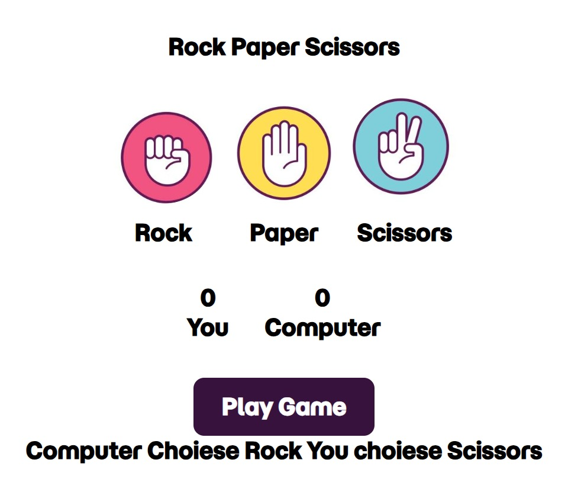

# 🎮 Rock Paper Scissors Game

A simple and interactive **Rock Paper Scissors** game built using **HTML, CSS, and JavaScript**.  
This project was created to practice basic frontend concepts and JavaScript logic.

## 🚀 Live Demo
🔗 https://rock-paper-scissors-game-silk-nine.vercel.app/

## 🛠️ Technologies Used
- HTML5  
- CSS3  
- JavaScript (Vanilla JS)

## ✨ Features
- User vs Computer gameplay  
- Random computer moves  
- Instant result display (Win / Lose / Draw)  
- Simple and responsive UI  

## 📂 Project Structure
├── index.html ├── style.css └── script.js

## 🧠 How to Play
1. Choose **Rock**, **Paper**, or **Scissors**
2. Computer will choose randomly
3. Result will be displayed instantly

## 📸 Screenshot

